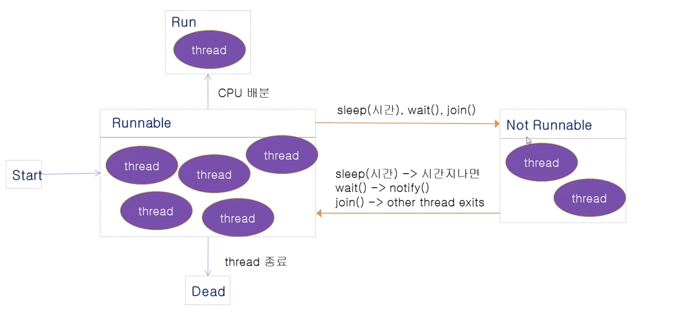

# JAVA Thread 구현 - BASIC

### 1. Thread 란?

| Category | Description                                                  |
| -------- | ------------------------------------------------------------ |
| Process  | - 실행중인 프로그램<br>- OS로 부터 메모리를 할 당 받는다.    |
| Thread   | - 실제 프로그램이 수행 되는 작업의 최소 단위<br>- 하나의 프로세스는 하나 이상의 Tread를 가지게 된다.<br>- 즉 Tread는 프로세스에 속한는 작업 단위 |

### 2. Java 에서 Tread 구현 

- Thread 를 상속(extends) 받는다.

  ```java 
  class MyTread extends Thread{
      public void run(){
          int i;
          for (int j = 0; j < 10; j++) {
              System.out.print(j + "\t");
              try {
                  sleep(100);
              } catch (InterruptedException e) {
                  e.printStackTrace();
              }
  
          }
      }
  }
  
  public class ThreadTest {
      public static void main(String[] args) {
          System.out.println("start");
          MyTread th1 = new MyTread();
          MyTread th2 = new MyTread();
  
          th1.start();
          th2.start();
          System.out.println("end");
      }
  }
  
  ```

- Runnable 을 implements한다.

  ```java 
  class MyTread implements Runnable{
      public void run(){
          int i;
          for (int j = 0; j < 10; j++) {
              System.out.print(j*2 + "\t");
              try {
                  Thread.sleep(100);
              } catch (InterruptedException e) {
                  e.printStackTrace();
              }
  
          }
      }
  }
  
  public class ThreadTest {
      public static void main(String[] args) {
          System.out.println("start");
  
          MyTread runner = new MyTread();
          Thread thread = new Thread(runner);
          thread.start();
          MyTread runner2 = new MyTread();
          Thread thread2 = new Thread(runner2);
          thread2.start();
          System.out.println("end");
      }
  }
  ```

  

### 3. Thread 활용

Thread는 아래와 같은 그림으로 작동한다.


> 출처: 페스트 캠퍼스 온라인 강의 : Java 웹 개발 마스터 

*Not Runnable : CPU를 점유 할 수 없는 상태*

##### 1) Thread methods

- Sleep: Thread에 sleep()을 걸면 해당 시간 만큼 Not Runnable상태가 된다. 시간이 지나면 다시 Runnable 상태가 된다.

- Wait: Thread에 wait()을 걸면 해당 Thread는 Not Runnable상태가 된다. 만약 notify() method를 걸면 다시 Runnable상태가 된다.

- Join: A Thread를  B Thread에 join()하면 B Thread 가 종료 될때까지 A Thread는 Not Runnable상태가 된다. B Thread가 종료되면 A Thread는 다시 Runnable상태가 된다. 

  다른 thread의 결과를 보고 진행 해야 하는 일이 있는 경우 join() method를 활용

  ```java 
  public class JoinTest extends Thread{
  
      int start;
      int end;
      int total;
  
      public JoinTest(int start, int end){
          this.start =start;
          this.end = end;
      }
  
      public void run(){
          int j;
          for (j = start ; j < end; j++) {
              total+=j;
          }
      }
  
      public static void main(String[] args) throws InterruptedException {
          JoinTest jt1 = new JoinTest(1, 50);
          JoinTest jt2 = new JoinTest(51, 80);
  
          jt1.start();
          jt2.start();
  
          jt1.join();
          jt2.join();
  
          int total = jt1.total + jt2.total;
          System.out.println("jt1.total = " + jt1.total);
          System.out.println("jt2.total = " + jt2.total);
  
          System.out.println(total);
      }
  }
  ```

  위와 같이 main Thread에 join을 걸지 않으면 total을 돌릴때마다 다른 값이 나올 것이다. 즉 jt1.join() 을 실행하면 jt1이 다 실행 될때까지 main Thread는 Not Runnable상태가 될 것이고 jt2.join() 도 마찬가지로 같은 동작을 유도 할 것이다. 그렇기 때문에 total을 항상 같은 값이 나오게 된다.

- Interrupt method()

  - 다른 thread에 예외를 발생시키는 interrupt를 보낸다.
  - thread가 join(), sleep(), wait() method에 의해 Not Runnable상태가 되었을 경우 interrupt를 통해 다시 Runnable 상태가 될 수 있다.

  ```java 
  package com.company.thread;
  
  public class InterruptTest extends  Thread{
  
      public void run(){
          int i;
          for (i = 0; i < 50; i++) {
              System.out.println(i);
          }
  
          try {
              sleep(5000);
          } catch (InterruptedException e) {
              System.out.println(e);
              System.out.println("Wake!!");
          }
      }
  
      public static void main(String[] args) {
          InterruptTest test = new InterruptTest();
          test.start();
          test.interrupt();
  
          System.out.println("end");
      }
  }
  ```

  다음과 같이 interrupt를 걸 경우 sleep 상태에 빠지지 않고 바로 exception을 던져 Wake를 실행 한다.

- Thread 종료

  - 데몬 등 무한 반복 하는 thread가 종료 될 수 있도록 run() method내의 while문을 활용
  - Thread.stop()은 사용하지 않는다.

  ```java 
  public class TerminateThread extends  Thread{
  
      private boolean flag = false;
      int i;
  
      public TerminateThread(String name){
          super(name);
      }
  
      public void run(){
          while(!flag){
              try {
                  sleep(100);
              } catch (InterruptedException e) {
                  e.printStackTrace();
              }
          }
  
          System.out.println(getName()+ " end");
      }
  
      public void setFlag(boolean flag){
          this.flag = flag;
      }
  
      public static void main(String[] args) throws IOException {
          TerminateThread threadA = new TerminateThread("A");
          TerminateThread threadB = new TerminateThread("B");
  
          threadA.start();
          threadB.start();
  
          int in;
          while(true){
              in = System.in.read();
              if( in == 'A'){
                  threadA.setFlag(true);
              } else if( in == 'B'){
                  threadB.setFlag(true);
              } else if( in == 'M'){
                  threadA.setFlag(true);
                  threadB.setFlag(true);
                  break;
              }else{
                  System.out.println("try again");
              }
          }
          System.out.println("main end");
  
      }
  }
  ```

  위와 같이 flag 를 걸어 thread를 종료 시킬 수 있다.

##### 2) Thread priority

- 우선 순위가 높은 thread는 CPU를 배분 받을 확률이 높다.
- Thread.MIN_PRIORITY(=1)~Thread.MAX_PRIORITY(=10)
- Default priority(디폴트 우선순위): Thread.NORM_PRIORITY(=5)
- setPriority(int newPriority) : Priority 지정
- Int getPriority() : Priority 값을 가져오기

##### 3) 현재 Thread출력 방법

```java 
public class ThreadTest {
    public static void main(String[] args) {
        Thread t = Thread.currentThread();
        System.out.println(t);
    }
}
```

위의 값을 출력하면 `Thread[main,5,main]` 다음과 같은 값이 나온다.

- `main` : Thread 명을 의미하며 현재 main Thread라는 걸 의미
- `5` : 우선 순위를 의미한다.
- `main` : 해당 Thread 어느 Thread 그룹 에 속해 있는지 의미

