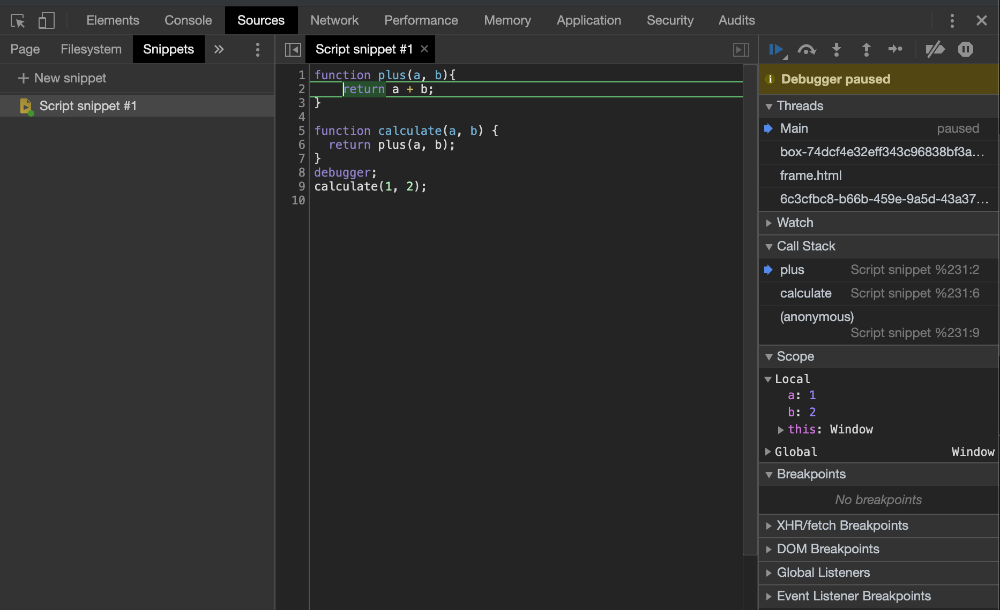

# Callstack and Memory heap

### 1. Callstack 과 Memory heap이 필요한 이유

Javascript engine은 코드를 작동시키기 위해 해당 코드를 읽고 실행 하기위해 정보(데이터, 변수 등등) 저장하고 한줄 한줄 코드를 실행시키고 한줄 한줄 코드가 무슨 역할을 하는지 추적할 수 있어야 한다.이를 위해 Javascript engine은 `callstack` 과 `memory heap` 을 사용한다.

- `Memory heap`: 정보(데이터, 변수, object 등) 정보를 저장하는 공간
- `Calstack`:  코드의 실행순서를 저장하는 공간, callstack에 코드의 실행 순서를 저장함으로써 현재 동작하고 있는 코드를 추적할 수 있다.

### 2. Memory Heap

- 자바스크립트 엔진이 제공하는 메모리를 저장하는 공간

### 3. Callstack

- First In Last Out 구조로 실행 된다.

  ```js 
  function plus(a, b){
  	return a + b;
  }
  
  function calculate(a, b) {
    return plus(a, b);
  }
  
  calculate(1, 2);
  ```

  우와 같이 함수를 작성하고 실행하면 우선 calculate함수와 plus함수 는 memory heap에 저장 되고 calculate > plus 순서로 데이터가 저장 된다. 

  Callstack은 First In Last Out으로 작동 하므로 plus 함수가 먼저 실행 되고 그 이후에 calculate 함수가 실행이 된다.

- 다음은 크롬 개발자 환경에서 콜스택을 직접 확인해본 결과 이다. `anonymous` 는 `global execution context`를 의미한다. 


### 4. Garbage collection

javascript는 garbage collector가 존재하여 메모리 누수(memory leaks)를 방지하기 위하여 사용하지 않는 메모리를 정리한다. 보통 Garbage collector만 믿고 메모리에 대한 관리를 하지 않는 경우도 있는데 Garbage collector가 메모리를 정리하지 못하는 경우도 있으므로 주의해야 한다.

javascript garbage collection은 `mark and sweep` 알고리즘을 사용한다. 

- `mark and sweep`: 필요한 메모리는 mark하고 필요없는 메모리는 sweep 해 버린다.
  - Mark: 여전히 참조가 되어있는 objects를 mark한다
  - Sweep: 메모리속의 모든 objects를 스캔하고 mark가 되지 않은 모든 objects들을 삭제한다.