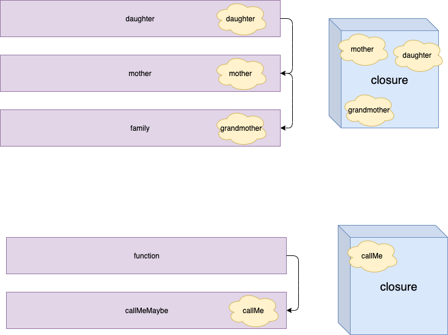

# Closures

### 1. Closures

closures란 또다른 function 을 return 하는 function을 의미한다.

```js 
function family(){
  let grandmother = 'grand mother'
  return function mother (){
		let mother = 'mother'
    return function daughter(){
      let daughter = 'daughter'
      return `${grandmother} ${mother} ${daughter}`
    }
  }
}

family()()();

function family2(grandmother){
  return function (mother){
    return function (daughter){
      return `${grandmother} ${mother} ${daughter}` 
    }
  }
}

const familyOne = family2('Nana');
const familyTwo = familyOne('Mama');
const familyThree = familyTwo('Dada');

familyThree;
```

아래와 같이 함수안에 setTimeout함수를 부를때도 `closures` 속성이 관여한다.

```js 
function callMeMaybe() {
    const callMe = 'Hi!';
    setTimeout(function() {
        console.log(callMe);
    }, 4000);

}

callMeMaybe();
```

아래의 그림과 같이 각각의 function은 서로 scope chain을 통해 해당 함수가 콜스택에서 빠져나간다 해도 closure박스에서 연결되어있는 변수들을 저장하기 때문에 맨 마지막에 불려지는 함수에서 상위 함수의 변수들을 사용 할 수있다.



### 2.Closures 사용 장점

- memory 사용에 효율적이다.

  다음과 같은 함수가 존재 한다.

  ```js 
  function heavyDuty(item) {
    const bigArray = new Array(7000).fill('😄')
    console.log('created!');
    return bigArray[item]
  }
  
  heavyDuty(699)
  heavyDuty(699)
  heavyDuty(699)
  ```

  위와 같이 함수를 실행하면 함수를 실행할때마다 `bigArray` 가 선언되고 실행 될것이다. 위의 코드를 아래와 같이 closure함수로 변경 하여 bigArray는 한 번만 선언될 수 있도록 변경 할 수 있다.

  ```js 
  function heavyDuty2() {
    const bigArray = new Array(7000).fill('😄')
    console.log('created Again!')
    return function(item) {
      return bigArray[item]
    }
  }
  
  const getHeavyDuty = heavyDuty2();
  getHeavyDuty(699)
  getHeavyDuty(699)
  getHeavyDuty(699)
  ```

  이렇게 사용하므로써 closure함수는 불필요한 메모리 할당을 줄일 수 있어 메모리를 좀 더 효율적으로 사용할 수 있도록 도와준다.

- Encapsulation

  closure함수를 사용하여 다음과 같이 외부에서 해당 코드에 접근을 못하도록 `encapsulation` 을 할 수 있다.

  ```js 
  const makeButton = () => {
    let time = 0;
    const passTime = () => time++;
    const totalPeaceTime = () => time;
    const launch = () => {
      time = -1;
      return '🎉';
    }
  
    setInterval(passTime, 1000);
    return {totalPeaceTime}
  }
  
  const flower = makeButton();
  flower.totalPeaceTime();
  ```

  위와 같이 time 변수에 직접적인 접근을 못하게 하고 싶은 경우 `totalPeachTime` 함수를 return하여 해당 함수의 값은 확인 할 수 있지만 직접 적인 접근은 못하도록 encapsulation을 할 수 있다.

### 3. Closure 예제 

**예제1** : view 변수를 한번만 initialize 하는 함수를 작성해보자.

```js 
let view;
function initialize() {
  view = '🌈';
  console.log('view has been set!');
  return function(){
    return true;
  }
}

const init = initialize();
init();
init();
```

**예제2** : var i의 값이 제대로 출력 되도록 코드를 작성해보자.

```js 
const array = [1,2,3,4];
for(var i=0; i < array.length; i++) {
  (function(closureI) {
    setTimeout(function(){
      console.log('I am at index ' + array[closureI])
    }, 3000)
  })(i)
}
```

