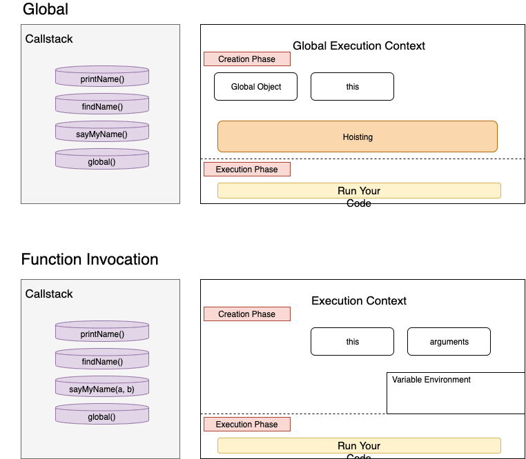

# Execution Context


### 1. Execution Context란

```js 
function printName() {
  return 'bam';
}
function findName(){
  return printName();
}
function sayMyName(){
	return findName();
}
sayMyName();
```

위와 같이 `sayMyName`함수를 작성한 후 다음과 같이 `sayMyName()` 함수를 실행 시켜 보자. `()` 이렇게 함수를 실행 시키면 각각 함수의 `Execution Context`가 생성 될 것 이다.

아래와 같은 그림을 살펴보자. 각각의 함수가 생성될때마다 해당 함수들은 본인의 `Execution Context` 를 생성한다.



먼저 `Global Execution Context` 를 살펴보자. Global Execution Context의 `Creation Phase`에서는 다음과 같이 `Global Objects`와 `this`가 생성된다.
이때 `this === window` 라고 생각 하면 된다. 아래에서 자세히 설명하겠지만 이때 `Hoisting`을 실행한다. 이 후 `Execution Phase`에서 코드를 실행 시킨다.
모든 `Execution Context` 는 `Scope Chain`을 통해 `Global Execution Context`를 최 상위 부모로 가지고 있다.

다음은 `sayMyName()`와 같은 함수를 호출하여 생성한 (function invocation) Execution Context 를 살펴보자.
`Function Invocation` 으로 생성된 Execution Context에는 `this`, `arguments`, `variable enviroment` 가 존재한다.
- `arguments` : 해당 함수에 인자로 들어오는 값들을 의미한다.
- `variable enviroment` : 해당 함수내에서 생성된 변수들을 의미한다.


### 2. Lexical Enviroment 

`Lexical Enviromet`란 작성하고 있는 코드가 어느 `Execution Context`에 속하는지를 의미한다.

```js 
function a(){
	function b(){
		console.log('I belong to a');
	}
	console.log('I belong to Global');
}
```

위의 함수중 `a` 는 `global execution context` 에 속하고 `b`는 `a execution context`에 속하게 된다.

어떤 `Lexical Enviroment`에 속하는지에 따라 접근할 수 있는 코드가 다르다.


### 3. Hoisting

1) Hoisting 이란? 

자바스크립트가 실행될때 함수는 `Hoisting` 되어서 실행 될때 위로 끌어 올려진다. 다음 예제를 살펴보자

```js 
console.log(name);
console.log(sayMyName());

var name = 'hey';
function sayMyName(){
	return 'hello'; 
}
```

위의 코드는 Javascript Engine에서 `Hoisting`으로 다음과 같이 작동한다.

```js 
var name = undefined;
function sayMyName(){
	return 'hello'; 
}

console.log(name);
console.log(sayMyName());
```

- var는 완전히 hoisting 되지는 않는다.
- function declaration으로 선언된 함수는 완전히 hoisting 된다.
- 물리적으로 다음과 같이 함수를 위로 올리지는 않는다. Create phase에서 해당 코드를 한번 훑은 후 메모리에 할당 하여 저장을 한 후, Execution Phase에서 코드를 실행 할때 메모리에서 해당 데이터를 찾는다.

2) Hoisting 예제

- 다음과 같이 똑같은 `var` 변수를 여러번 대입 하는 경우 처음 hoisting 할때 `undefined`를 할당하기 때문에 undefined를 출력한다.

  ```js 
  console.log(a);  // undefined
  
  var a = 1;
  var a = 2;
  ```

- 다음과 같이 함수를 hoisting 하는 경우 똑 같은 이름의 함수에 새로운 함수가 적용될때 마다 메모리에 할 당값이 달라져서 마지막으로 작성한 함수 값이 출력 된다.

  ```js 
  console.log(a()); //world
  
  function a(){
    return 'hello';
  }
  
  function a(){
    return 'world';
  }
  ```

- Hoisting 은 Execution Context내에서 이루어지기 때문에 play 함수 내에서는 해당 함수의 Execution context에 영향을 받는다 그렇기 때문에 해당 Execution context 에서는 instrument가 hoisting되면서 undefined으로 정의 되기 때문에 처음 출력은 undefined으로 출력 된다.

  ```js 
  var instrument = 'guitar';
  
  var play = function() {
    console.log('the instrument is ', instrument);  //undefined
    
    var instrument = 'piano';
    console.log('the new instrument is ', instrument); //piano 
  }
  
  play();
  ```

  

3) 에러 예제

**에러 1**

만약 다음과 같이 `()`로 함수를 감싼다면 `function`을 발견 하지 못해 hoisting 되지 않는다. > 에러 발생

```js
console.log(name);
console.log(sayMyName());

var name = 'hey';
(function sayMyName(){
	return 'hello'; 
})
```

**에러 2**

다음과 같이 let 함수를 사용하면 hoisting 되지 않고 에러가 발생한다.

```js 
console.log(name);
console.log(sayMyName());

let name = 'hey';
function sayMyName(){
	return 'hello'; 
}
```

**에러 3**

function expression 으로 선언된 함수는 hoisting 되지 않는다.

```js 
console.log(sayMyName());

var sayMyName = function(){
	return 'hello'; 
}
```

하지만 다음과 같이 `()` 를 제거 하고 `sayMyName`만 불렀을 경우는 부분 hoisting으로 인해 undefined가 출력 될 것이다.

```js 
console.log(sayMyName);

var sayMyName = function(){
	return 'hello'; 
}
```

