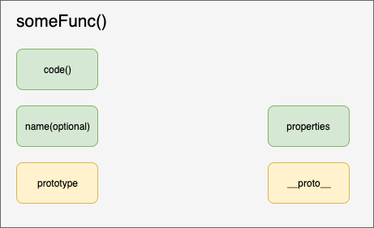

# Function

### 1. Function은 Object이다.

```js 
function a() {

	return 1;
}

a.hey = 'haha';
a(); // 1
a.hey; // haha
```

function 은 `object` 이다. 새로운 데이터를 저장할 수 도 있고 function을 다른 인자로 넘길 수 도 있다. 또 변수에 대입시킬 수 도 있다. 다음은 function object의 구조를 나타낸 그림이다.



- code() : function을 invoke했을때 실행되는 코드
- Name: function의 이름(선택적)
- Properties: function에 포함되어 있는 properties로 call, bind, apply등이 존재한다.

### 2. function 의 활용

- 변수에 대입

  ```js 
  var a = function(){};
  ```

- 인자로 전달

  ```js 
  function a(fn){
  	fn();
  }
  
  a(function(){console.log('hi there')});
  ```

- return

  ```js 
  function b(){
    return function c(){console.log('b')};
  }
  
  var d = b();
  d();
  ```

### 3. Higher Order Function

Higher Order Function 은 다른 `function` 을 `return` 하는 함수이다.

```js 
const multiplyBy = function (num1){
  return function(num2){
    return num1*num2;
  };
}

const multiplyByTwo = multiplyBy(2);
multiplyByTwo(3);
const multiplyByFour = multiplyBy(4);
multiplyByFour(5);
```

