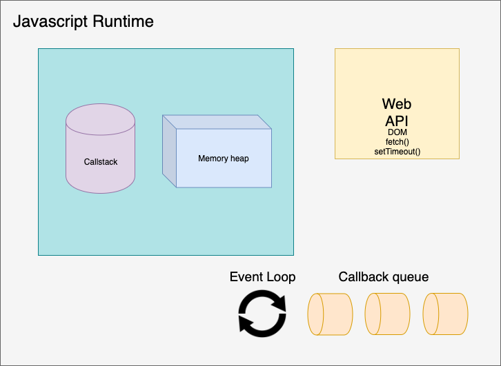

# Javascript runtime

### 1. Single Threaded 

자바스크립트는 `single thread`를 가진 언어로 `오직 하나의 callstack과 하나의 memory heap`을 가지고 있다. 그렇기 때문에 한번에 하나의 동작밖에 작동 시키지 못한다.

### 2. Javascript Runtime

다음은 Javascript Runtime을 설명하는 그림이다.



Javascript 코드가 동기화 되면서 작동 할때 browser는 백그라운드에서 동작을 한다. 이때 browser는 `WEB API` 를 사용한다. 이때 web api 는 javascript engine과 상호작용 한다.

- `Web Api`: 

  - browser(ex Chrome, Firefox..) 는 Javascript Runtime을 가지고 있으며 Javascript Runtime에는 Web Api 가 장착 되어 있다.
  - Http request 를 보내거나 Dom에 관련하여 이루어지는 동작들을 주시하며 setTimeout() 함수들을 가지고 있다.
  - 크롬 개발자 도구의 Console 창에 `window` 를 검색해보면 우리가 사용할 수 있는 Web Api 기능들을 확인 할 수 있다.
  - `Asynchronous` 방식으로 동작 한다. 

- `Web Api, Callback queue, Event Loop 동작방식`:

  - 만약 Callstack에 `setTimeout()` 함수가 들어오면 해당 기능은 자바스크립트에 포함된 것이 아니라 Web Api에 포함된 것이 기 때문에 callstack은 해당 함수를 web api로 전송 한다. web api 는 해당 함수를 실행한 후 return 된 데이터 혹은 callback함수를 `Callback Queue`에 전달 한다. 이후 `Callstack`이 비어있으면 해당 데이터 혹은 함수를 callstack에 다시 전달 하여 실행 시킨다.

  ```js 
  console.log('1');
  setTimeout(()=>{console.log('2'), 1000}); // web api로 전송
  console.log('3');
  
  //return
  1
  3
  undefined
  2
  ```

  - 이때 `event loop`은 callback queue에 데이터가 존재하면 `callstack`이 계속 비었는지 확인하고 비었으면 callstack에 push 하는 역할을 한다.

> 자바스크립트 Runtime을 직접 테스트 해볼 수 있는 사이트 > [Javascript runtime playground](http://latentflip.com/loupe/?code=ZnVuY3Rpb24gcHJpbnRIZWxsbygpIHsNCiAgICBjb25zb2xlLmxvZygnSGVsbG8gZnJvbSBiYXonKTsNCn0NCg0KZnVuY3Rpb24gYmF6KCkgew0KICAgIHNldFRpbWVvdXQocHJpbnRIZWxsbywgMzAwMCk7DQp9DQoNCmZ1bmN0aW9uIGJhcigpIHsNCiAgICBiYXooKTsNCn0NCg0KZnVuY3Rpb24gZm9vKCkgew0KICAgIGJhcigpOw0KfQ0KDQpmb28oKTs%3D!!!PGJ1dHRvbj5DbGljayBtZSE8L2J1dHRvbj4%3D)

### 3. Javascript Engine VS Javascript Runtime

| Category           | Description                                                  |
| ------------------ | ------------------------------------------------------------ |
| Javascript         | 음악을 구성하는 요소중 악보라고 생각하면 된다.<br />어떤 프로그램을 작성하여 어떻게 동작시킬지 작성하는 파일 |
| Javascript Engine  | 음악을 구성하는 요소중 지휘자 라고 생각하면 된다.<br />작성된 javascript를 해석하고 동작시킨다. |
| Javascript Runtime | 음악을 구성하는 총 package를 의미한다(음악 연주자, 음악도구 등등).<br />프로그램이 실행되는 동한 사용 가능한 내장된 라이브러리를 제공 하는 환경을 의미한다. |

### 4. Node.js 란?

- Node.js란 runtime으로 browser밖에서도 자바스크립트를 실행 할 수 있게 해준다. 
- Server side platform
- browser runtime에서 `window`를 검색하면 web api의 함수를 확인 할 수 있듯이Node.js 에는 `global`이 존재한다. 
- Node.js 역시 `V8` 엔진을 톤해 자바스크립트를 해석하고 실행 하지만 `Web Api`가 존재하지 않는대신 `LIBUV`가 존재한다.
- Single threaded 이지만 Node.js runtime 환경으로 Asynchronous`으로 동작을 하여 `None Blocking` 상태로 동작이 가능하다.