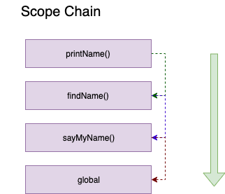

# Scope chain, IIFE


### 1. Scope Chain

다음과 같은 함수가 정의 되었다고 가정해보자.

```js
function sayMyName(){
    var a = 1;
    return function findName(){
        var b = 2;
        console.log(a);
        return function printName(){
            var c = 3;
            console.log(b);
            return 'bam';
        };       
    };
}
```

위와 같은 함수의 `Scope chain`은 다음과 같이 생성된다.



printName()  >  findName()  >  sayMyName()  > global

그렇기 때문에 printName은 b, c 변수에 모두 접근 가능 하고 findName()은 a 변수에 접근이 가능하다. 하지만 findName()이 c에 접근 하는 것은 불가능하며 sayMyName() 역시 b, c에 접근이 불가능하다.

### 2. Block Scope

```js 
if(4 < 6){
	var word = 'hi';
}

word;  //hi
```

javascript 에서 `var` 을 사용하면 위와 같이 word가 제대로 출력되는 것을 볼 수 있다. 즉, block scope이 되지 않는다 그렇기 때문에 block scope 를 사용하기 위해서는 `let, const` 를 사용해야 한다.

```js 
if(4 < 6){
	let word = 'hi';
}

word;  //error!
```

**for 문에서도 let, const는 block scoping을 가지고 있다**

```js 
function loop() {

	for(let i = 0; i < 5; i++){
	console.log(i);
	}
	console.log('final ', i); //error
	
}
loop(); 
```

### 3. IIFE

만약 모든 변수를 global scope에 할당하면 어떻게 될까? 

- 해당 변수를 미리 할당해놓은 것을 잊어버리고 똑같은 변수명으로 만들어 overwrite해버리는 문제가 발생 할 수있다(namespace collision).

이러한 문제를 우리는 `IIFE` 로 해결 할 수 있다.

```js 
(function() {
	var a = 1;
})();
```

- IIFE 안에 선언된 변수들은 Global scope에 포함되지 않고 IIFE안에 선언된 함수 내에서만 사용될 수 있도록 해당 scope안에 선언이 된다. 즉 a는 global scope에서 접근이 불가능 하다.

다음과 같이 `jquery` 를 IIFE를 이용하여 사용할 수 있다.

```js 
var test = (function($){
  $('h1').click(function(){
    $('h1').hide();
  });
  return {
    $: 'hi';
  };
})(jQuery);
```

- 위와 같이 jQuery를 사용한다면 `jQuery`는 해당함수의 `인자값` 으로 넘겨져 해당 `$` 를 사용할때 global scope까지 찾아 올라갈 필요 없이 `local scope` 내에서 찾아서 사용 할 수 있다.