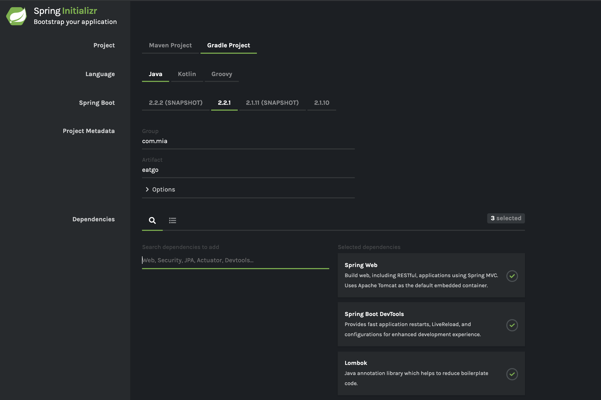

# Spring Boot 쉽게 시작하기

### 1. [Spring.io](https://spring.io/) 사이트에서 Spring Initializr 이용

- 해당 사이트로 이동 한 후 [PROJECTS](https://spring.io/projects) 메뉴 클릭

- 프로젝트 리스트중 `Spring Boot` 클릭 

- 이 후 `Quick Start Section` 에서 [Spring Initializr](https://start.spring.io/) 을 클릭

- 아래와 같이 옵션을 선택 한 후 `Generate the project` 를 클릭

  

### 2. IntelliJ Idea에서 Spring Initializr 이용

- IntelliJ Idea에서 Project > New를 클릭
- Spring Initializr를 선택 
- Project Metadata에서 원하는 옵션을 선택 (ex. Type > Gradle Project)
- Dependencies 리스트 에서 자기가 원하는 Dependencies를 선택 Web -> Spring Web
- Project name과 Location을 입력 
- Finish 클릭 